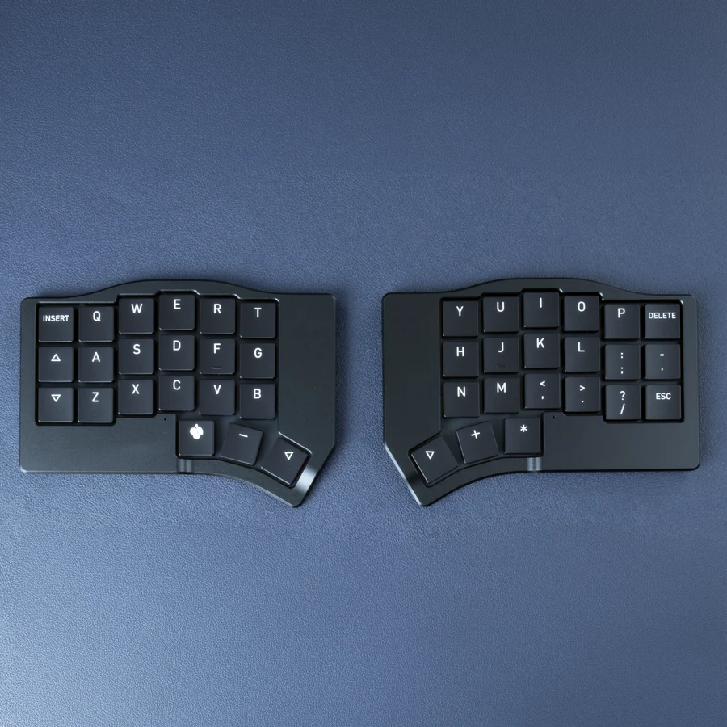

## Source

* **Source Repository**: https://github.com/MechboardsLTD/zmk-config/tree/corne-min
* **Build Commit / Run:** https://github.com/MechboardsLTD/zmk-config/actions/runs/35359678806

## Firmware Files

| File Name | Description |
| :--- | :--- |
| corne_min_left_with_studio.uf2 | Studio enabled |
| corne_min_right.uf2 | Studio enabled |
| corne_min_settings_reset.uf2 | Reset firmware |

