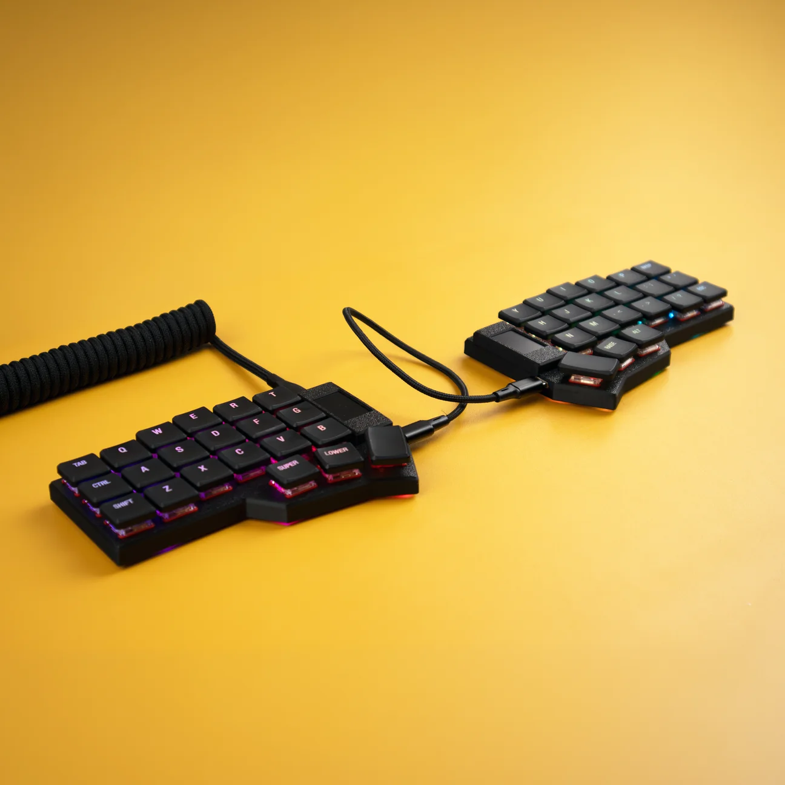

## Source

* **Source Repository**: https://github.com/MechboardsLTD/vial-qmk/tree/r2g/keyboards/mechboards/crkbd/r2g
* **Build Commit / Run:** https://github.com/MechboardsLTD/vial-qmk/commit/7847fc74cd55396816d9eadbbc113385c5a4d0d4

## Firmware Files

| File Name | Description | Target Hardware |
| :--- | :--- | :--- |
| mechboards_crkbd_r2g_6col_vial.uf2 | Vial enabled, 6 Columns, MX/Choc | RP2040 / Refer to image |
| mechboards_crkbd_r2g_5col_vial.uf2 | Vial enabled, 5 Columns, MX/Choc | RP2040 / Refer to image | 

