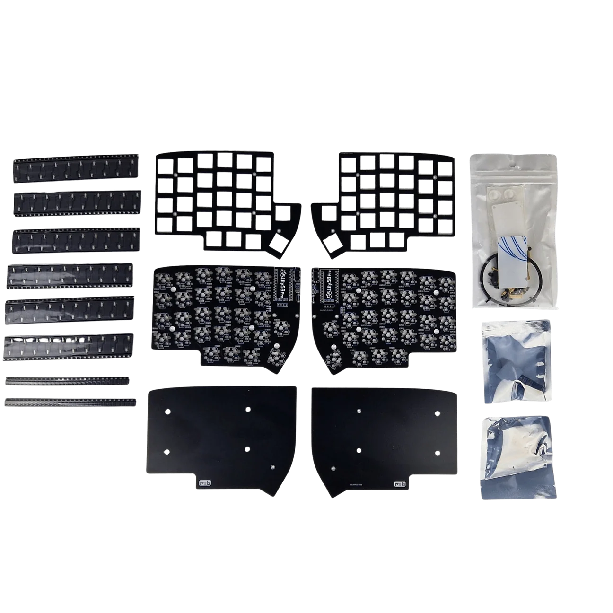

## Source

* **Source Repository**: https://github.com/the-via/qmk_userspace_via
* **Binary source:** https://caniusevia.com/docs/download_firmware/

## Firmware Files

| File Name | Description | Target Hardware |
| :--- | :--- | :--- |
| mechboards_lily58_pro_via.uf2 | VIA enabled | RP2040 |

